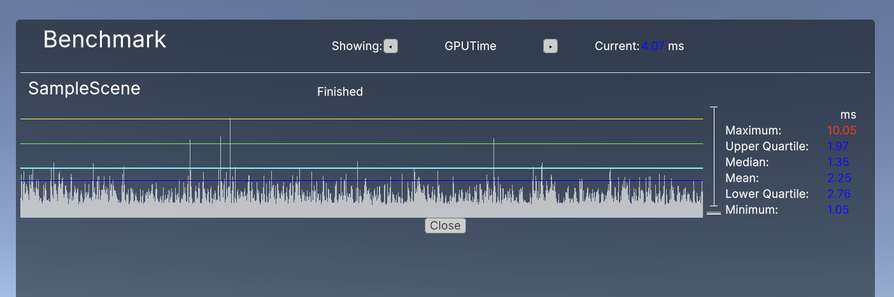

# How to benchmark

* Works with Unity 6 or higher
* Download a package from release tab and import to your unity project.
* Add Benchmark scene (Assets/Benchmark/BenchmarkScene.unity ) as first scene in the scene list for building.
* Add other scenes that you want to benchmark to scene list.
* Edit PerformanceTest component from Benchmark gameobject of Benchmarkscene to add benchmark tests.
* Play Benchmark scene in the editor or runtime build.
